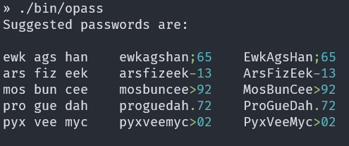
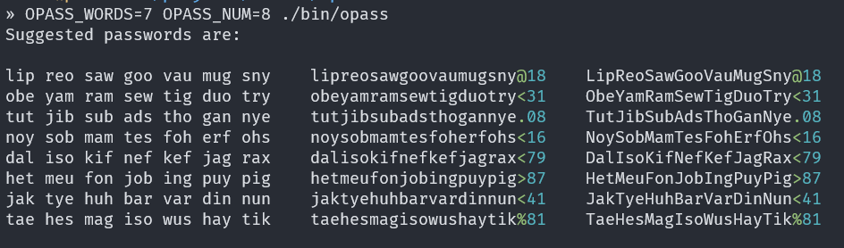

[](https://raw.githubusercontent.com/hyperium/hyper/master/LICENSE)


## PASSWORD GENERATOR - ONE JOB DONE SIMPLY AND WELL
A simple, small, single binary, cross-platform command line application that suggests 
strong and safe passwords using a large pool of English language
three letter words. Each offered randomly generated password includes 
an additional random character, and a two digit random number.  

## Downloading the Application

The program is available for most computer operating systems as a single
binary that has no additional installation requirements. Just download a binary and add  
the program to your computer operating systems PATH, or copy it to an existing
directory already in you PATH.

Pre-compiled binaries are provided for Windows (x64), Linux (x64 and aarch64), and
macOS (x64 and arm64) - all available for download from the
[Releases](https://github.com/wiremoons/opass/releases) page.

Stable releases are:
- [opass Release 1.0.0](https://github.com/wiremoons/opass/releases/tag/v1.0.0)

See the addtional informaiton below on how to customise the programs output, and 
also the '**Support**' section below, if you have any other problems.

## More details about opass

`opass` (short for '*offer password*') is a password creation tool
which uses a pool of three letter English words to generate password
suggestions. The three-letter words are randomly selected from the
pool, creating password suggestions and displaying them on the screen
for the user to select from.

In addition, to the large word list used, the program also generates a random 
two-digit number (ie 00 to 99), and a random character. These different 
combinations or randomly generated components significantly enhance the 
generated passwords overall security. The inclusion of upper and lower case 
three letter word options for each generated password further significantly 
enhances the security and 'difficulty to crack' benefits of the offer passwords.

The additional characters (marks) to complement the words and random number have 
been limited to those that are easily found on most keyboards. This is to help ensure  
the password should be safe to enter without depending on different 
keyboard maps. 

The randomly selected mark will be taken from the following list: 
```console
# . , ; @ % : ! > - <
```

The output of the suggested password is also in colour (but can be turned off 
if preferred) to help differentiate between to suggested word, numbers, and 
marks.

Finally, the number of words used in each password (so controlling its generated 
password length), and the number of passwords offered to select from, can also be 
controlled by the user.

The opass program is written in the C language, and is a command line /
terminal based program. It should compile and then run on any platform
that supports the C programming language, such as on Windows, macOS, and
Linux, FreeBSD, etc.

A three letter English word list of over 1,000 words was acquired for
use in the application, from the Association of British Scrabble
Players (ABSP) web page is here: http://www.absp.org.uk/words/3lw.shtml

## Using the Application

A number of command line flags can be specified when the program is run 
which are shown below:
```console
Help Summary: the following command line switches can be used:

  -e, --export     Dump the full list of three letter words and marks.
  -h, --help       Show this help information.
  -q, --quick      Just offer a password and no other output.
  -v, --version    Display the version of the program and password stats.
```
Either the long form or short form flags can be used, depending on user preference.

## Application Screen Outputs

Below are examples of the outputs display when the program is run.

Below is the default output when the program is just run as `opass` or `opass.exe`:



Below is the output when the program is run as `opass` or `opass.exe` but the output is
set to display password strings made up from seven (7) different three letter words, and
to show eight (8) different random passwords for the user to select from:



Information is displayed on screen when the user requests *help* via the command line flags 
(either `-h` or `--help`) which explains the programs usage and includes example 
commands for Windows and unix based systems (ie Linux; macOS, etc).

### Controlling Offered Password Output

Two environment variables can be used to control offered password configuration:

- **OPASS_WORDS** : helps control the overall password length;
- **OPASS_NUM** : the number of password generated for the user to select from.

These perform the following tasks to override the applications defaults - only if needed:
```console
- OPASS_WORDS=<number of three letter words to include>
- OPASS_NUM=<number of passwords to offer>
```

These can be set in the shell, or just given when needed on the command line. Examples of 
running *opass* in different ways are shown below:

**Example usage 1:**  `opass`

Shows default usage provides the equivalent command of: `OPASS_WORDS=3 OPASS_NUM=5 opass`

**Example usage 2:**  `OPASS_WORDS=7 OPASS_NUM=8 opass`

Usage ensures *seven random three letter words* are included and *eight different
password choices* will be offered to the user to select from.

**Note for Windows users:** the above command examples need to be adapted as shown below:

For Windows '`cmd.exe`' use: `set "OPASS_WORDS=7" & set "OPASS_NUM=8" & opass`

For Windows '`Powershell`' use: `$env:OPASS_WORDS=7 ; $env:OPASS_NUM=8 ; opass`

### Managing NO_COLOR Output

Output will use ANSI colour by default. The '**NO_COLOR**' environment is respected and colour
output is disabled if it is set.

This can also be specified on the command line by running commands as shown below:

For Windows '`cmd.exe`' use:            `set "NO_COLOR=1" & opass`

For Windows '`Powershell`' use:         `$env:NO_COLOR=1 ; opass`

For macOS, Linux, '`Unix shells`' use:  `NO_COLOR=1 opass`

See: https://no-color.org/ web site for more information about `NO_COLOR` support in 
applications.

## Building the Application

Pre-compiled binaries are provided via the 
[Releases](https://github.com/wiremoons/opass/releases) page. If 
you wish to build the program yourself, follow the instructions below.

A C compiler will be needed to build the application. There are no additional 
library dependencies. If you wish to use the *CMake* build option, the both 
*CMake* amd *make* are required too.

Before building the application, download a copy of the source code, and unzip it. 
If you have `git` installed, then just clone this GitHub *opass* repo to your computer with:
```console
git clone https://github.com/wiremoons/opass.git
```


### Compiling (no CMake required)

On Windows using MingGW, compile the program as `opass.exe` with: 
```console
gcc -Wall --std=gnu11 -Dsrandom=srand -Drandom=rand -static -DDEBUG=0 -DNDEBUG -o opass ./src/opass.c ./src/output.c
```

On Unix (Linux/macOS/etc), compile the program as `opass` using with:
```console
gcc -Wall --std=gnu11 -static -DDEBUG=0 -DNDEBUG -o opass ./src/opass.c ./src/output.c
```

### Compile with CMake

The following command can be used to generate a build file and compile 
the program on Windows 10 using *MingGW* and *CMake* for Windows.

```console
mkdir build
cd build
cmake -G "MinGW Makefiles" ..
```

The following command can be used to generate a build file and compile 
the program on a Unix system. Or alternatively the commands below are 
included in the provided shell script:  `./build.sh` to auto automate 
the CMake build process. Otherwise, run the following commands:

```console
mkdir build
cd build
cmake ..
```

## Support

The `opass` program is opensource and free, so you are able (if you wish) to change and 
update the program to customise it to your own needs. However, if you find a bug or have a 
problem, maybe a suggestion for a new feature etc, please open an issue (or add your 
thoughts to an already existing one) using the link below.

### Raising and Issue

If the help and the specific support below does not fix your problem when using `opass` 
please open an issue using the link below. Please describe the problem you are having, 
and I will try to help you fix it if possible!

- [opass Issues](https://github.com/wiremoons/opass/issues)

### Colour Output on Windows is Broken?
On Windows the program works well with both `cmd.exe` and `Powershell` - however on 
older Windows versions the colour output may not display correctly.

When running `opass.exe` on Windows, the offered passwords may include additional 
characters. These are the ANSI escape codes used to switch on and off the colour 
output - that older versions of Windows doesn't understand properly.

This can quickly be 'fixed' as a workaround by specifying on the command line 
the 'NO_COLOR' option as shown below:

- For Windows '`cmd.exe`' use:            `set "NO_COLOR=1" & opass.exe`
- For Windows '`Powershell`' use:         `$env:NO_COLOR=1 ; opass.exe`

A better solution (that will improve other programs usage and outputs too!) is to instead use 
Microsoft's much improved and more modern '*Terminal*' application. This is being rolled out 
by Microsoft to become the **default** on all Windows 10 computers, but if you want to install 
it yourself - it is also available for free from the Microsoft Windows Store:

- [Microsoft Terminal](https://www.microsoft.com/en-gb/p/windows-terminal/9n0dx20hk701)

Once installed and used, `opass` should display all output correctly. 


## License

The program is licensed under the "MIT License" see
http://opensource.org/licenses/MIT for more details.
